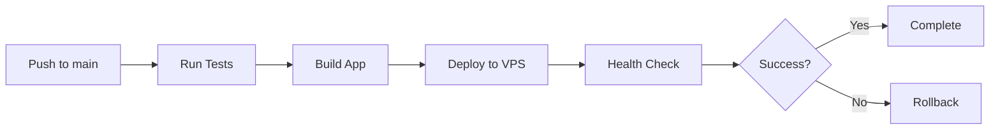

# CI/CD Setup Guide for FamilyToDo

This guide explains how to set up continuous integration and deployment for FamilyToDo.

## Table of Contents
- [Overview](#overview)
- [GitHub Secrets Setup](#github-secrets-setup)
- [VPS Initial Setup](#vps-initial-setup)
- [Deployment Workflow](#deployment-workflow)
- [Manual Deployment](#manual-deployment)
- [Health Monitoring](#health-monitoring)
- [Troubleshooting](#troubleshooting)

## Overview

The CI/CD pipeline automatically:
1. Runs tests on every push to main
2. Builds the application
3. Deploys to your VPS
4. Performs health checks
5. Rolls back on failure

## GitHub Secrets Setup

Go to your GitHub repository → Settings → Secrets and variables → Actions

Add these secrets:

| Secret Name | Description | Example |
|------------|-------------|---------|
| `VPS_HOST` | Your VPS IP address | `142.93.123.45` |
| `VPS_USER` | SSH username for VPS | `root` or `ubuntu` |
| `VPS_SSH_KEY` | Private SSH key for VPS access | Full SSH private key content |
| `DEPLOY_PATH` | Path where app will be deployed | `/home/familytodo/app` |

### Generating SSH Key for GitHub Actions

On your local machine:
```bash
# Generate a new SSH key pair
ssh-keygen -t ed25519 -f ~/.ssh/familytodo_deploy -C "github-actions"

# Copy the public key to your VPS
ssh-copy-id -i ~/.ssh/familytodo_deploy.pub user@your-vps-ip

# Display the private key to copy to GitHub Secrets
cat ~/.ssh/familytodo_deploy
```

## VPS Initial Setup

### Quick Setup (Recommended)

Run this one-liner on your fresh VPS:
```bash
curl -sSL https://raw.githubusercontent.com/vivesm/FamilyToDo/main/scripts/vps-setup.sh | sudo bash
```

This will:
- Install Docker & Docker Compose
- Install Node.js & PM2
- Setup Nginx reverse proxy
- Configure firewall
- Setup automatic backups
- Clone the repository

### Manual Setup

If you prefer manual setup:

1. **Install Dependencies**:
```bash
# Update system
sudo apt update && sudo apt upgrade -y

# Install Docker
curl -fsSL https://get.docker.com | sh
sudo usermod -aG docker $USER

# Install Docker Compose
sudo curl -L "https://github.com/docker/compose/releases/latest/download/docker-compose-$(uname -s)-$(uname -m)" -o /usr/local/bin/docker-compose
sudo chmod +x /usr/local/bin/docker-compose

# Install Node.js (optional, for PM2 deployment)
curl -fsSL https://deb.nodesource.com/setup_18.x | sudo -E bash -
sudo apt-get install -y nodejs
sudo npm install -g pm2
```

2. **Clone Repository**:
```bash
git clone https://github.com/vivesm/FamilyToDo.git ~/familytodo
cd ~/familytodo
```

3. **Configure Environment**:
```bash
cp backend/.env.production backend/.env
nano backend/.env  # Edit with your settings
```

## Deployment Workflow

### Automatic Deployment

Every push to the `main` branch triggers automatic deployment:



### Manual Deployment

To trigger deployment manually:
1. Go to Actions tab in GitHub
2. Select "Deploy to VPS" workflow
3. Click "Run workflow"
4. Select branch and click "Run"

Or from command line:
```bash
gh workflow run deploy.yml
```

## Local Deployment Commands

### Using Docker (Recommended)

```bash
cd ~/familytodo
./scripts/deploy.sh production
```

### Using PM2

```bash
cd ~/familytodo/backend
npm install --production
npm run build
pm2 start npm --name familytodo -- start
pm2 save
pm2 startup
```

### Using the Deployment Script

```bash
# Deploy to production
./scripts/deploy.sh production

# Deploy to staging
./scripts/deploy.sh staging
```

## Health Monitoring

### Run Health Check

```bash
# Basic health check
./scripts/health-check.sh

# Verbose health check
./scripts/health-check.sh -v

# Check remote server
./scripts/health-check.sh -u http://your-vps-ip:4000
```

### Health Check Endpoints

- `/api/health` - Basic health status
- `/api/health/detailed` - Detailed system info

### Monitoring with curl

```bash
# Quick health check
curl http://localhost:4000/api/health

# Check specific endpoint
curl http://localhost:4000/api/tasks
```

## Docker Commands

### Production Deployment

```bash
# Build and start
docker-compose -f docker-compose.production.yml up -d --build

# View logs
docker-compose -f docker-compose.production.yml logs -f

# Stop
docker-compose -f docker-compose.production.yml down

# Restart
docker-compose -f docker-compose.production.yml restart

# With backup service
docker-compose -f docker-compose.production.yml --profile with-backup up -d

# With Nginx
docker-compose -f docker-compose.production.yml --profile with-nginx up -d
```

## Environment Configuration

### Production .env Settings

```env
# Server
PORT=4000
NODE_ENV=production

# Database
DATABASE_PATH=./data/familytodo.db

# CORS (update with your domain/IP)
CORS_ORIGIN=http://your-vps-ip:4000,https://yourdomain.com
SOCKET_CORS_ORIGIN=http://your-vps-ip:4000,https://yourdomain.com

# Uploads
UPLOAD_DIR=./uploads
MAX_FILE_SIZE=5242880

# Optional: Tailscale
TAILSCALE_NETWORK=100.64.0.0/10
```

## SSL Setup (Optional)

### With Certbot

```bash
# Install certbot
sudo apt install certbot python3-certbot-nginx

# Get certificate
sudo certbot --nginx -d yourdomain.com

# Auto-renewal is configured automatically
```

### Manual Nginx SSL Config

```nginx
server {
    listen 443 ssl;
    server_name yourdomain.com;
    
    ssl_certificate /etc/letsencrypt/live/yourdomain.com/fullchain.pem;
    ssl_certificate_key /etc/letsencrypt/live/yourdomain.com/privkey.pem;
    
    location / {
        proxy_pass http://localhost:4000;
        # ... rest of proxy config
    }
}
```

## Backup Strategy

### Automatic Backups

The VPS setup script configures daily backups at 2 AM:

```bash
# View backup schedule
crontab -l

# Manual backup
~/backup.sh

# List backups
ls -la ~/backups/
```

### Manual Backup

```bash
# Backup database
cp backend/data/familytodo.db ~/backups/familytodo_$(date +%Y%m%d_%H%M%S).db

# Backup uploads
tar -czf ~/backups/uploads_$(date +%Y%m%d_%H%M%S).tar.gz backend/uploads/

# Restore database
cp ~/backups/familytodo_20240823_120000.db backend/data/familytodo.db
```

## Troubleshooting

### Common Issues

#### 1. GitHub Actions Deployment Fails

Check:
- SSH key is correctly added to GitHub Secrets
- VPS firewall allows SSH (port 22)
- User has sudo privileges

```bash
# Test SSH connection
ssh -i ~/.ssh/familytodo_deploy user@vps-ip "echo Connected"
```

#### 2. Application Won't Start

```bash
# Check logs
docker-compose logs familytodo

# Or with PM2
pm2 logs familytodo

# Check port availability
sudo lsof -i :4000
```

#### 3. Database Issues

```bash
# Check database integrity
sqlite3 backend/data/familytodo.db "PRAGMA integrity_check;"

# Restore from backup
cp ~/backups/familytodo_latest.db backend/data/familytodo.db
```

#### 4. Memory Issues

```bash
# Check memory usage
free -h

# Restart to free memory
docker-compose restart

# Or with PM2
pm2 restart familytodo
```

### Debug Mode

Enable debug logging:

```bash
# In .env
DEBUG=true
LOG_LEVEL=debug

# Restart application
docker-compose restart
```

### Rollback Procedure

If deployment fails:

```bash
# Automatic rollback happens on failure
# Manual rollback to previous version
git checkout HEAD~1
./scripts/deploy.sh production

# Or restore from backup
docker-compose down
cp ~/backups/familytodo_working.db backend/data/familytodo.db
docker-compose up -d
```

## Security Notes

1. **Never commit secrets** - Use environment variables
2. **Use Tailscale** for secure VPN access
3. **Enable firewall** - Only expose necessary ports
4. **Regular updates** - Keep dependencies updated
5. **Monitor logs** - Check for suspicious activity

## Support

For issues or questions:
1. Check the [troubleshooting section](#troubleshooting)
2. Review GitHub Actions logs
3. Check application logs with `docker-compose logs`
4. Open an issue on GitHub

## Next Steps

After setting up CI/CD:

1. **Configure monitoring** - Setup Netdata or similar
2. **Setup alerts** - Configure email/Slack notifications
3. **Performance tuning** - Optimize based on usage
4. **Regular backups** - Verify backup strategy works
5. **Security audit** - Review and harden security settings